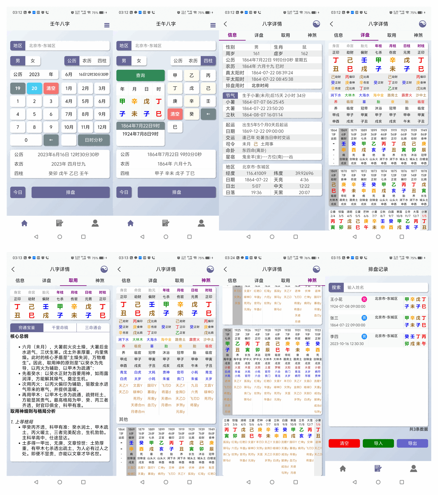

## 软件简介

软件完全离网本地运行无需登录注册，不获取任何手机权限，无任何弹窗广告。使用2025年的最新行政区划和地理经纬度数据。核心排盘算法依据寿星天文历。支持公历、农历、四柱反查排盘。暂只支持安卓端，4.2及以下鸿蒙，卓易通能否安装未知，个人开发财力有限，无法测试更多机型。

## 软件截图

## 软件优势

#### 一、简化排盘输入

简化日期和地区输入，地区输入支持身份证前六位的区划代码搜索，同时兼容地区名称模糊搜索，快速定位出生地。

公农历输入简化年月的输入，以数字键盘的形式快速定位出生年份，点击选择的方式快速确定月份。四柱反查严格依照五虎遁和五鼠遁，输入月干和时干后快速定位月时柱地支，只要输入的四柱符合五虎遁和五鼠遁至少返回一条匹配的公历日期。

#### 二、流派支持优化

排盘支持真太阳时，早晚子时，五行长生和十干长生，人元司令分野支持渊海子平，三命通会，子平真诠三种模式。

#### 三、出生日期信息优化

提供了更详尽出生日信息，除了包括基础的年龄、性别、节气和起运信息外，增加出生地经纬度，当日天亮、日出、中天、日落、天黑的时间信息，可以更好的衡量时支五行力量。“节气”按钮可展示一整年的节气信息。

#### 四、古籍参考优化

《穷通宝鉴》原文排版逻辑较为杂乱晦涩难懂，非常不利于初学者。在保留核心要意的前提下重新整理排版，便于阅读理解。《千里命稿》部分对常用的15中格局进行整理，删减原文大量冗余描述，适合格局派初学者参考。《三命通会》提供了六十甲子日时断的内容。

#### 五、神煞优化

- 使用多本古籍联合对照校正神煞查法。现今排盘软件神煞查法极为混乱，同一种神煞有按年干支或日干支查的，也有日时干支同查的，更有出现严重查法错误的，程序员只照书编写算法，但从未质疑过作者是否会错漏。

- 以神煞“九丑”为例，多个软件查法错的一模一样，都是照着《神煞推命学》原封不动抄下来的,干支顺序都丝毫不差。殊不知这本书150页与127页同时记录“九丑”描述，但内容却前后矛盾不一，诸如此类不再赘述。

- 在神煞展示方面也进行了优化，一些神煞确实因为流派等原因会出现年日同查的情况，如天乙，桃花等，此时四柱地支可能同时出现多个相同的神煞，神煞来源不清初学者经常混用。本软件增加了字母标识用以区分，如Y/y/D/d/m分别代表年干、年支、日干、日支、月支所查神煞，没有尾缀的便是以此柱所查神煞，如魁罡、阴差阳错等，由此可以快速定位神煞来源。

- 同时修正了一些神煞的查法，如太极贵人、德秀贵人，针对这两种神煞大部分排盘软件的做法是单见一干或一支即命中，但此法与古籍本意完全背离，由此造成德秀、太极贵人在命局里“泛滥成灾”。

- 在大运、流年、流月神煞的展示上区别于其他排盘软件，直接显示在对应流年流月列表底部方便查看。同时增添了盲派串宫压运和盲派九星的内容，适当兼顾盲派学者(盲派串宫压运是按照流年地支起太岁法，所以流年板块显示的是当前流年所属大运的干支十二神)。

- 关煞内容暂未加入，这部分内容极具文字误导性，易使人望文生义自我误导，个别心术不正之人会以此恐吓他人借机敛财。我无法确定软件使用群体是否有扎实的命理基础知识、客观理智的判断力、良好的思想道德。

#### 六、排盘记录优化

- 软件提供了排盘记录保存功能，但经过慎重考虑未提供自动保存排盘的功能，改为手动保存，个人认为排盘记录里展示一堆叫“某某”的记录是毫无意义的，无论是命理学习者还是从业者，应该对每个八字给予足够的尊重，如果你愿意保存他就别嫌麻烦输个名字。

- 断语备注方面，本软件只提供一个文本域输入框自由发挥，摆脱传统排盘软件每一项信息点选的固定输入格式。保存记录的同时也同步保存当前排盘设置，如是否使用真太阳时，早晚子时，长生模式和人元司令模式等，保证八字复盘时的准确性。

- 同时简化排盘记录数据导入导出的操作，避免操作文件获取手机权限。只需点击“导出”所有记录自动导出到私有目录可以通过另存和分享保存到其他位置，有能力的可进行二次开发，如制作个人命理数据库等。
- 排盘记录普通用户上限365条，每条限制备注长度500字符，有特殊需求的可以联系沟通。

#### 七、题外篇

- 个人精力和技术有限，无法保证程序没任何bug瑕疵，软件因技术架构和不咋地的编程水平，运行流畅度稍差，但总体可用。整理古籍资料时也无法做到逐条仔细核对，部分工作也会交由AI处理，错漏之处在所难免。没学过UI设计所以配色布局只能达到“可以看，尽量不错乱”的水平，软件操作逻辑也是多半按照个人使用习惯设计，无法满足所有人需求，只能说尽力了。

- 夏令时考虑现实原因未加入，中国幅员辽阔，各个地域对于夏令时执行程度不一，名义上全国统一执行，但落实地方后因各种原因“名存实亡”，那个年代通信不发达也没有所谓的网络对时，很多人家里甚至没有黑白电视。广大农村地区的人民还是遵照日出而作日落而息的生产生活习惯，家里上铉的钟表也多是摆设。一些单位机构实行夏令时后严重打乱了工作生产节奏又被迫偷偷调回，最后只是名义上执行。出生在那个时间段的人他们父母都很少有能记清当时是不是用了夏令时。若是有这方面需求的可以自行手动校正一小时。

- 至于流日流时的的功能现在没有加入，将来可能也不会考虑加入。人一生几十年，用八字去预测某一天或某一时辰未免不切实际。能在流年尺度上预测准确率达到八成的都十不存一，何况日时。不否认有能人的存在，只是那种层次的人也不屑于使用软件排盘了。

- 再就是关于小限（小运）的问题，小限查法用法争议颇多，经典命理书籍提及使用的很少，难以形成系统理论。emm...说人话就是本人单纯懒不想再增加适配工作量了，我没法做出让所有人满意的软件，能认可我的终究也只是那一小戳儿人。我吃不惯咸粽子甜豆腐脑儿，也会有人吃不惯咸豆腐脑甜粽子，注定无法求同存异的还是互相远离为好。

- 开发这个app的目的一是方便自己使用，二是为了稍微扩散点影响力赚些口粮而已。软件的一些功能限制如记录上限、单条记录内容长度限制，排盘页的标题更改等也是出于私心想做用户分级。若是一开始不限量后期再做限制很容易引起用户不满，有特殊需求的可以沟通。

   Version 1.2.0(2026年3月31日)
•输入年份开放至公元618年-2100年（唐朝起）。
•首页顶部增加太阳☀动画图标，快速开启关闭真太阳时。
•增加夏令时提示（1986-1991）。
•四柱反查支持年范围公元618年-2100年。
•四柱反查改为自动查询。
•四柱反查支持切换朝代筛选匹配八字。
•信息页增加年号信息。
•信息页增加各朝代“皇帝”简介（点击朝代信息查看）。
•信息页增加省份信息简介（点击地区一行）。
•信息页增加东西四命及命卦计算（点击命卦）。
•增加神煞页“四柱”吸顶设置，四柱不随页面滚动。
•增加大运流年<->身命胎柱互切功能（点击年干切换）。
•增加五虎遁表（点击月干）
•增加五鼠遁表（点击时干）
•增加60甲子纳音五行分类表（点击纳音）
•增加十干长生规则表（点击长生/自坐）
•增加60甲子表、旬空旬首速算表（点击旬首旬空）
•流年增加小运（丙寅壬申法）
•大运、流年、流月神煞变为可点击状态可查看相关词条，切换大运流年需点击非神煞区域。
•增加伏吟、反吟、空亡、“月反（月柱反吟）”词条。
•增加长生模式 “水土同行”。
•排盘记录页增加相似八字搜索功能。可按日干+月支或日干+月支+时支搜索相似八字（需要将原数据导出后再导入重新建立数据库索引）。
•优化UI交互效果，添加操作提示。
•优化代码逻辑提高流畅性。
•修复个别文字描述错误。
•重写软件说明书。
•此次更新兼容原有数据导入导出。

  #### 联系

  邮箱：e.nd@qq.com

  QQ群：20478793

  #### 下载

  - [发布](https://github.com/renwubazi/paipan/releases)

  - 百度云https://pan.baidu.com/s/1XaC0oRxpB85DS-axy68q3A?pwd=sxjn 提取码: sxjn

    

天下熙熙皆为利来，天下攘攘皆为利往。

